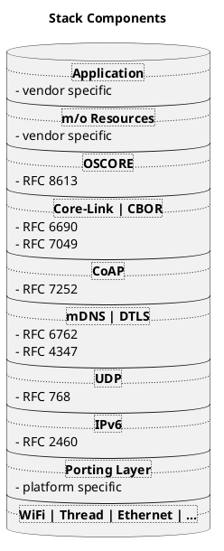

[TOC]

# Introduction 

A common (stack) introduction and further information how to use the demo apps in ETS6 (including commissioning) is available 
on the KNX IoT [documentation pages](https://buildwithknxiot.knx.org/public-projects/knx-iot-docs/), 
more branch specific topics are listed here below. 

- To directly jump the demo apps, go [here](https://gitlab.knx.org/public-projects/knx-iot-point-api/knx-iot-point-api-demos).
- To understand the repository content the follwoing figure shows the used stack layers. 



# Project Directory Structure

__api/*__  
Contains the implementations of: 

* client/server APIs 
  * (rest) API 
  * (programming) API
* resources
* utility and helper functions to encode/decode CBOR to/from data points (function blocks)
* module for encoding and interpreting endpoints 
* handlers for the discovery, device and application resources

__messaging/coap/__  
Contains a tailored CoAP implementation.

__security/*__  
Contains resource handlers that implement the security model, using OSCORE.

__utils/*__  
Contains a few primitive building blocks used internally by the core framework.

__include/*__  
Contains all common headers.

__include/oc_api.h__  
Contains client/server APIs.

__include/oc_rep.h__  
Contains helper functions to encode/decode to/from cbor.

__include/oc_helpers.h__  
Contains utility functions for allocating strings and arrays either dynamically from the heap or from pre-allocated memory pools.

__port/\*.h__  
Contains the shared platform abstractions.

- DNS/SD 
  - The stack uses an own MDNS/DNS-SD code, to support KNX IoT specific subtypes, such as **_pm._sub._knx._udp.local.** 
- Clock
  - The stack uses the clock functions only to evaluate time differences, such as with seconds 
    to inform a client on a server reboot startup time. An absolute (RFC 3339 UTC) time stamp 
    is optional and - if used -  only applicable for the endpoint `swu/lastupdate`. For this see the corresponding endpoint on the [Point API Schema](https://gitlab.knx.org/public-projects/knx-iot-point-api-schema/-/blob/work_in_progress/knxiot-point-api-scheme-openapi.yaml?ref_type=heads).
- Logging
  - The logging functions, either for the console print out or file print.    
- Random
- Storage 
  - The root folder for a possible storage output is created by the CMake build system, usually it is 
    the build "output" folder. The provided applications ('apps') creates an own (individually named) 
    storage folder in this root folder. This allows copying of the executables to other folders without 
    having to know which folder to create.

__port/\<OS>/*__  
Contains adaptations per supported OS platform. 

- **Linux** 
- **Windows**  
- **Zephyr**

## Dependencies

External project dependencies for the IoT stack repository uses CMake **fetchcontent** as part of the build system. 
The following external dependencies are used:

- **tinyCBOR** A small CBOR implementation in C, used for encoding/decoding CBOR data.
- **mbedTLS** A lightweight cryptographic library in C, used for implementing security features such as OSCORE.

## Building

The stack is typically consumed as a library by the
[KNX IoT Point API Demos](https://gitlab.knx.org/public-projects/knx-iot-point-api/knx-iot-point-api-demos)
via CMake `FetchContent`. See the
[demos repository README](https://gitlab.knx.org/public-projects/knx-iot-point-api/knx-iot-point-api-demos/-/blob/HEAD/README.md)
for the full build instructions, including prerequisites, IDE walkthroughs,
and CMake preset tables.

To build the stack standalone (for example to run tests), use
[CMake Presets](https://cmake.org/cmake/help/latest/manual/cmake-presets.7.html).
CMake 3.21+ and Ninja are required.

```bash
cmake --preset <preset-name>
cmake --build --preset <preset-name>
```

Run `cmake --list-presets` to see all available configure presets.