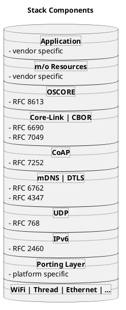
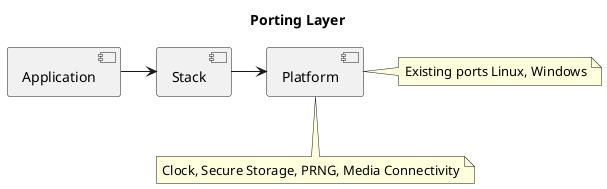
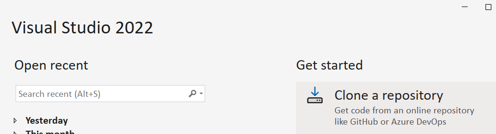
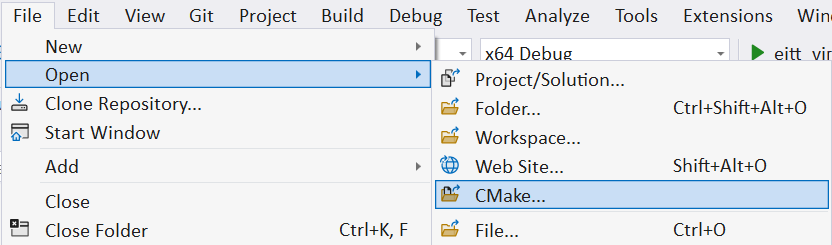

# Introduction

KNX IoT Point API stack is an open-source, reference implementation of the KNX IoT standard for the Internet of Things (IoT). 
Specifically, the stack realizes all the functionalities of the KNX IoT Point API specification.


   
The responsibilities between the stack and an actual KNX IoT Point API device implementation is depicted 
in the following diagram.


The project was created to bring together the open-source community to accelerate the development of the KNX IoT Point API devices and services required to connect the growing number of IoT devices. 
The project offers device vendors and application developers royalty-free access under the [Apache 2.0 license](LICENSE.md).

# Stack Features

* **OS Agnostic** 

  The KNX IoT Point API device stack and modules work cross-platform (pure C code) and execute in an event-driven style. 
  The stack interacts with lower level OS/hardware platform-specific functionality through a set of abstract interfaces. 
  This decoupling of standards related functionality from platform adaptation code promotes ease of long-term maintenance 
* and evolution of the stack through successive releases.



* **Porting Layer** 

  The platform abstraction is a set of generically defined interfaces which elicit a specific contract from implementations. 
  The stack utilizes these interfaces to interact with the underlying OS/platform. 
  The simplicity and boundedness of these interface definitions allow them to be rapidly implemented on any chosen OS/target. Such an implementation constitutes a "port".

# Project Directory Structure

__api/*__
* contains the implementations of: 
  * client/server (rest) APIs as described in <https://gitlab.knx.org/public-projects/knx-iot-point-api-schema> 
  * resources
  * utility and helper functions to encode/decode CBOR to/from data points (function blocks)
  * module for encoding and interpreting endpoints 
  * handlers for the discovery, device and application resources

__messaging/coap/__
* contains a tailored CoAP implementation

__security/*__
* contains resource handlers that implement the security model, using OSCORE

__utils/*__
* contains a few primitive building blocks used internally by the core framework

__deps/*__
*  contains external project dependencies from below
   
    __deps/tinycbor/*__
    * contains the tinyCBOR sources

    __deps/mbedtls/*__
    * contains the mbedTLS sources

    __include/*__
    * contains all common headers

    > The IoT stack repository uses GIT **submodules** to retrieve the (above desribed) external code as part of the 
      version control system (also possible is to use CMake **fetchcontent** that handels it as part of the build system). 
      The `.gitmodules` file defines the folder/path per submodule, the specific commit ID is defined in 
      the corresponding folder with a gitlink (name@commit). See git/stack overflow documentation for gitmodules (how to pull or init submodules).   

__include/oc_api.h__
* contains client/server APIs

__include/oc_rep.h__
* contains helper functions to encode/decode to/from cbor

__include/oc_helpers.h__
* contains utility functions for allocating strings and arrays either dynamically from the heap or 
  from pre-allocated memory pools

__port/\*.h__
* collectively represents the platform abstraction

__port/<OS>/*__
* contains adaptations for each OS. Platforms:
  
  - **Linux**
    Storage folder is created by the make system.

  - **Windows**
    Storage folder is automatically created by the make system. As extra also the stack creates the storage folder.
    This allows copying of the executables to other folders without having to know which folder to create.

__apps/*__
* contains the sample [application](apps/Readme.md) desribeding how to use the stack

# Build instructions

Grab source and dependencies from GitLab 
The build system enviroment is based on CMake, various IDEs (or command line tools) can be used for this. 


## Windows 

### Prerequisities

 - Windows (10/11) machine
 - [CMake](https://cmake.org/)
 - Development [IDE](https://cmake.org/cmake/help/latest/guide/ide-integration/index.html#ides-with-cmake-integration) 
    > on using Visual Studio 2022 C++ package needs to be installed    
 - git 
   - [gui/bash](https://git-scm.com/downloads/win) 
   - optinally a preferred IDE git extension/plugin
 - Python

 ### Build Steps 

``` Build 
 # clone the stack from your self created working folder (such as knx-iot-point-api-public-stack)
 git clone --recurse-submodules https://gitlab.knx.org/public-projects/knx-iot-point-api-stack.git
 
 # go into the cloned repo
 cd knx-iot-point-api-public-stack
```
Note that the above steps can also be performed directly in the IDE (example VS 2022). 

1. Clone Project

2. Open CMake Project (File `CMakeLists.txt`)

3. Build All
4. Set your desired debug executable as 'Startup Item' (e.g. initially eitt_virtual, see sample [application](apps/Readme.md)) 
5. Run w/wo Debug (F5/CTRL+F5)

## Linux 

### Prerequisities

- Linux machine
- [Cmake](https://cmake.org/)
- git
- gcc
- Python (preinstalled)

### Build Steps 

``` Build 
 # clone the stack from your self created working folder (such as knx-iot-point-api-public-stack)
 git clone --recurse-submodules https://gitlab.knx.org/public-projects/knx-iot-point-api-stack.git
 
 # go into the cloned repo
 cd knx-iot-point-api-public-stack
 
 # make a working directory (named anything)
 mkdir build
 cd build 

 # do the configuration step, e.g. build the native make files
 cmake ..

 # build the sdk, the -j is the amount of processor the build will be using
 make -j12

 # go back to the source directory
 cd ..
```