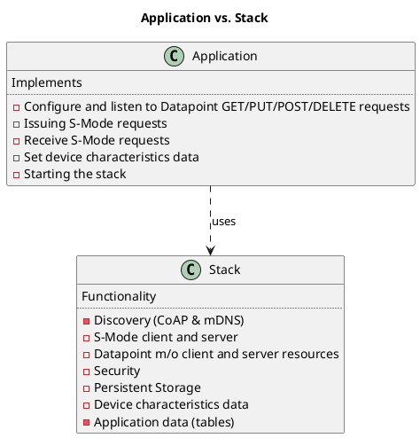
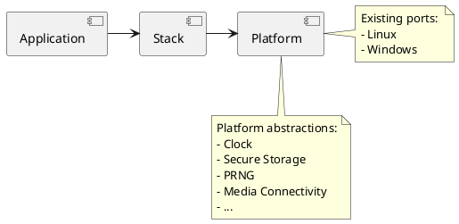

[TOC]

# Introduction

KNX IoT Point API stack is an open-source, reference implementation of the KNX IoT standard for the Internet of Things (IoT). 
Specifically, the stack realizes all the functionalities of the KNX IoT Point API specification.

::include{file=./images/stack.puml}
  
The responsibilities between the stack and an actual KNX IoT Point API device implementation is depicted 
in the following diagram.



The project was created to bring together the open-source community to accelerate the development of the KNX IoT Point API 
devices and services required to connect the growing number of IoT devices. 
The project offers device vendors and application developers royalty-free access under the [Apache 2.0 license](LICENSE.md).

The KNX IoT Point API infrastructure contains of the follwoing main componets.

**Device Callbacks**

- Application callbacks (datappoint r/w access, programming mode, ...)
- Reset/ restart callbacks
- Software update callback
- Host name callback

The corresponding callbacks are used in the device application, 
the callback code is defined in `oc_main.c/h`.

**Device Configuration Data**

- Installation ID (iid)
- Individual Address (ia)
- Serial Number (sn)
- Group Object/Publisher/Recipient/Security Tables

All configuration data is stored persistently.

**Datapoints**

- S-Mode Messaging Principle
- GET/POST access (including the to be used runtime flags read/write/ack)
- Types (DPT, DPA) 

:memo:
The tables, 'iid', 'ia' or S-Mode Messaging from above are explained in more detail 
as part of the KNX Point API Scheme Description (also an public repository):
- [Stack + Resources + Messaging](https://gitlab.knx.org/public-projects/knx-iot-point-api-schema/-/blob/release/1.1.0/README.md?ref_type=heads#knx-iot-point-api-stack)
- [Rest API Endpoints](https://gitlab.knx.org/public-projects/knx-iot-point-api-schema/-/blob/release/1.1.0/knxiot-point-api-scheme-openapi.yaml?ref_type=heads)

# Stack Features

* **OS Agnostic** 

  The KNX IoT Point API device stack and modules work cross-platform (pure C code) and execute in an event-driven style. 
  The stack interacts with lower-level OS/hardware platform-specific functionality through a set of abstract interfaces. 
  This decoupling of standards related functionality from platform adaptation code promotes ease of long-term maintenance 
  and evolution of the stack through successive releases.

* **Porting Layer** 

  The platform abstraction is a set of generically defined interfaces which elicit a specific contract from implementations. 
  The stack utilizes these interfaces to interact with the underlying OS/platform. 
  The simplicity and boundedness of these interface definitions allow them to be rapidly implemented on any chosen OS/target. 
  Such an implementation constitutes a "port".



# Project Directory Structure

__api/*__  
contains the implementations of: 
* client/server APIs 
  * (rest) API 
  * (programming) API
* resources
* utility and helper functions to encode/decode CBOR to/from data points (function blocks)
* module for encoding and interpreting endpoints 
* handlers for the discovery, device and application resources

__messaging/coap/__  
contains a tailored CoAP implementation

__security/*__  
contains resource handlers that implement the security model, using OSCORE

__utils/*__  
contains a few primitive building blocks used internally by the core framework

__deps/*__  
contains external project dependencies

 *  __deps/tinycbor/*__   
    contains the tinyCBOR sources

 *  __deps/mbedtls/*__  
    contains the mbedTLS sources
   
 > The IoT stack repository uses GIT **submodules** to retrieve the (above described) external code as part of the 
   version control system (also possible is to use CMake **fetchcontent** that handles it as part of the build system). 
   The `.gitmodules` file defines the folder/path per submodule, the specifically used commit ID is defined in 
   the corresponding folder with a gitlink (name@commit). 
   See git/stack overflow documentation for gitmodules (how to pull or init submodules).   

__include/*__  
contains all common headers

__include/oc_api.h__  
contains client/server APIs

__include/oc_rep.h__  
contains helper functions to encode/decode to/from cbor

__include/oc_helpers.h__  
contains utility functions for allocating strings and arrays either dynamically from the heap or 
from pre-allocated memory pools

__port/\*.h__
* collectively represents the platform abstraction

__port/\<OS>/*__  
contains adaptations for OS platforms
  
- **Linux**  
Storage folder is created by the make system.

- **Windows**  
 Storage folder is automatically created by the make system. As extra also the stack creates the storage folder.
 This allows copying of the executables to other folders without having to know which folder to create.

__apps/*__  
contains the sample [application](apps/Readme.md) describeding how to use the stack

# Build instructions

* The build system environment is based on [CMake](https://cmake.org/), various IDEs (or command line tools) can be used for this.
* The public repository link for the stack on GitLab is https://gitlab.knx.org/public-projects/knx-iot-point-api-stack.git

## Windows 

This "port" is preferably  used to test (virtual) applications together with the (windows based) KNX commissioning tool ETS and/or 
(windows based) KNX Interworking Test Tool (EITT), the latter is also used for the stack tests 
respectively the stack certification.

* Introduction on [EITT](https://support.knx.org/hc/en-us/sections/4409346784146) 
* Introduction on [ETS](https://www.knx.org/knx-en/for-professionals/software/ets6/), more ETS details can be found [here](https://support.knx.org/hc/en-us/sections/4404423716242)

### Prerequisites

 - Windows machine
 - CMake
 - (CMake) Development [IDE](https://cmake.org/cmake/help/latest/guide/ide-integration/index.html#ides-with-cmake-integration) 
    > on using Visual Studio 2022 C++ package needs to be installed    
 - git 
   - [gui/bash](https://git-scm.com/downloads/win) 
   - optionally some preferred git extension/plugin for the IDE
 - Python

 ### Build Steps 

:memo:
The below steps are explained for VS 2022, for a command line level see 
CMake [documentation](https://cmake.org/cmake/help/latest/manual/cmake.1.html). 

1. Clone Code from GitLab
   - [Example VS 2022](https://learn.microsoft.com/en-us/visualstudio/version-control/git-clone-repository) 
2. Open CMake Project 
   - file `CMakeLists.txt` 
   - [Example VS 2022](https://learn.microsoft.com/en-us/cpp/build/cmake-projects-in-visual-studio)

3. Build All 
   - output can be found in build folder, such as .../out/build/x64-debug/eitt_virtual.exe (x64 + debug)
4. Set 'Startup Item' 
   - your desired debug target, e.g. initially eitt_virtual executable, see sample [application](apps/Readme.md) 
5. Run 
   - w/wo Debug (F5/CTRL+F5)

## Linux 

This "port" is preferably used to develop a physical device based on a specific (linux based) hardware platform.  

### Prerequisites

- Linux machine
- CMake
- git
- gcc
- Python (preinstalled)

### Build Steps 

``` Build 
 # clone the stack from your self-created working folder (such as knx-iot-point-api-public-stack)
 git clone --recurse-submodules https://gitlab.knx.org/public-projects/knx-iot-point-api-stack.git
 
 # go into the cloned repo
 cd knx-iot-point-api-public-stack
 
 # make a working directory (named anything)
 mkdir build
 cd build 

 # do the configuration step, e.g. build the native make files
 cmake ..

 # build the sdk, the -j is the amount of processor the build will be using
 make -j12

 # go back to the source directory
 cd ..
```
## Compile Flags 

The compile flags are described in detail as part of the [CMakeLists.txt](CMakeLists.txt).