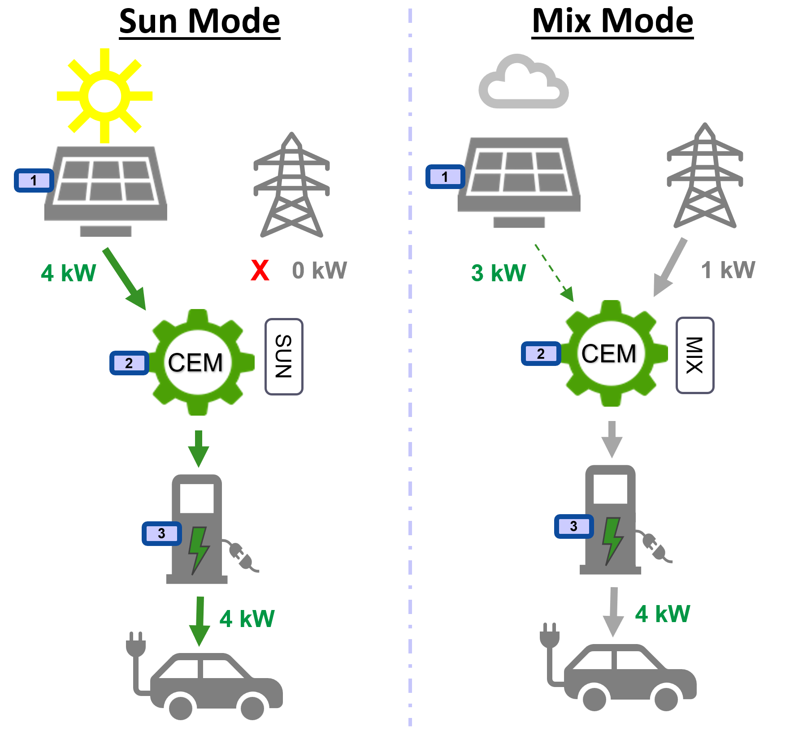

# Introduction

This folder contains the EMS apps.

EMS stands for Energy Management System.
These are the three EMS apps:
- PV
- CEM
- Charger

AH: write here what is the  use case doing (or refer to that below) 

## 1. PV app

PV stands for photovoltaic and the app represents the functionality of an Invertor PV control device.

> The current implementation contains one datapoint, representing 'present DC power', mimicking sun beam radiation or alike  
  This datapoint is represented by a slider, which allows the user to set the present DC power from 0 to 10 kW in steps of 1 kW and to send out the selected value to the medium.

## 2. CEM app

CEM stands for Central Energy Manager.

The app in this folder is intended to be used in and end-device, this HOWEVER does not represent its actual use in practice or in the field; CEM is to be considered as a specific functionality or even as a set of functionalities in the EMS context. Moreover including client (ETS alike) features, like scanning devices over the medium and linking them together into at least one building function.

There is an alternative Windows based CEM demo app foreseen, it covers both CEM features and client features, but is not within the scope of this project/repo.

> The current implementation contains two datapoints and foresees two operation modes.
  
  The first datapoint serves the role of capturing the present DC power from the medium, which is typically send out to the medium by Invertor PV control devices.
  
  The two operation modes are:
  - sun mode: the principle is to only charge the electric car at 4 kW if at least 4kW DC power is procuded by sun light (through PV panels)
  - mix mode: charge the electric car at 4 kW regardless of the present produced DC power by sun light
  The operation mode is represented by a dedicated button, wich allows the user to toggle its value, the current value is indicated inside the button, either 'sun' or 'mix'.
  
  The second datapoint sends, depending on the operation mode out to the medium the requested (calculated) charge rate, eihter at 0 kW or at 4 kW.

## 3. Charger app

This app represents the functionality of an Electric car charger device.

> The current implementation contains one datapoint and serves the role of capturing the requested charge rate from the medium, which is typically send out to the medium by CEM devices.

# Details 

In general:
- all four above mentioned datapoints are of the same type, being DPT: 14.056 AH: (see # References) 
- all three apps are based on the public KNX IoT stack and are at this stage only tested on Windows
- regarding the CEM demo app, see (???)

# References
- PV: description of the functional block(s), ref. latest released KNX Specifications: 7/8/1 Photovoltaics 
- Charger: description of the functional block(s): Application_EVSE AH: where to find? number is missing 
- Datapoints: DPT 14.056, ref. latest released KNX Specifications: 3/7/2 Datapoint Types 

## Commissioning

For the commissioning of these demo devices/apps two different scenarios need to be distinguished:
- without certification
- with certification

### Commissioning without certification: mini-client
This is the complete ETS commission procedure, which entirely of partly shall be implemented in as of client features:
- add/scan the certificate of the target device 
- scan the medium for the device's serial number or possible active programming mode
- SPAKE2+ onboarding to check the device's certificate (pre-shared key), an ex-factory reset of the target device might be required
- POST the WellKnownKnxIndividualAddress
- PUT the ProgrammingMode to False
- GET the IA (subnet address + device address) to check
- GET the ManufacturerID to check
- GET the HardwareType to check
- POST a WellKownKnx FactoryResetWithoutIA to reset the target device
- POST the LoadStateMachine to Unload
- GET the LoadStateMachine to check
- POST the LoadStateMachine to StartLoading
- POST all GroupObjectTable entries
- POST all RecipientTable entries
- POST all PublisherTable entries
- POST all AuthenticationTable entries
- PUT all Parameter values (if any)
- POST the LoadStateMachine to LoadComplete
- GET the LoadStateMachine to check
- GET the Fingerprint to check

AH: was not part of step 1-3, why here? 

### Commissioning with certification: ETS
- ETS (online) catalog entries need to be created for all three devices/apps by means of the KNX Manufacturer Tool 

## Group addresses

From the (data) functionality point of view, the three (virtual) device are linked by means of two group addresses:
- GA1 (0/0/1): links the 'Present DC power' datapoint (object) from the 'Inverter PV control' device **WITH** the 'Present DC power' datapoint (object) from the 'CEM' device
- GA2 (0/0/2): links the 'Charge rate power' datapoint (object) from the 'CEM' device **WITH** the 'Charge rate power' datapoint (object) from the 'Electric car charger' device

### IA (and serial number)

The IA of the three devices are set as follows, ETS notation:
-  PV: 15.15.15 (serial number = 00fa:1002:0b00)
-  CEM: 15.15.15 (serial number = 00fa:1002:0c00)
-  Charger: 15.15.15 (serial number = 00fa:1002:0d00)

### IID

The IID of the three devices is set to: 00fa:0000

### Group Object Table

The Group Object Tables of the three devices are set as follows:
  
- **PV**:
   -  url: '/p/pv'      cflags : '64' ...t.  ga : [ 0/0/1 ]
   
- **CEM**: 
   -  url: '/p/pv'      cflags : '16' .w...  ga : [ 0/0/1 ]
   -  url: '/p/charger' cflags : '64' ...t.  ga : [ 0/0/2 ]
  
- **Charger**:
   -  url: '/p/charger' cflags : '16' .w...  ga : [ 0/0/2 ]
  
### Publisher and Recipient Table

Both the Publisher and Recipeint Tables of the three devices are set as follows:
  
- **PV**:
   -  grpid:  00fa:0000  ga : [ 0/0/1 ]

- **CEM**: 
   -  grpid:  00fa:0000  ga : [ 0/0/1 0/0/2 ]
  
- **Charger**:
   -  grpid:  00fa:0000  ga : [ 0/0/2 ]
  
### Authentication Table

The Authentication Tables of the three devices are set as follows:
  
- **PV**:
   -  ga 0/0/1 osc_id [2]: 0001  osc_ms [16]: 00000000000000000000000000000000  osc_contextid (o)[6]: 000000000000
  
- **CEM**: 
   -  ga 0/0/1 osc_id [2]: 0001  osc_ms [16]: 000102030405060708090a0b0c0d0e0f  osc_contextid (o)[6]: 10020c000001
   -  ga 0/0/2 osc_id [2]: 0002  osc_ms [16]: 000102030405060708090a0b0c0d0e0f  osc_contextid (o)[6]: 10020c000002
  
- **Charger**:
   -  ga 0/0/2 osc_id [2]: 0002  osc_ms [16]: 00000000000000000000000000000000  osc_contextid (o)[6]: 000000000000

# Testing with Wireshark

To test with Wireshark (Windows) launch all three devices, move the slider to any value, **OSCORE** frames shall appear on the ethernet/wifi NIC.

The destination address of these captured frames shall be set to this IPv6 multicast address 'ff32:0030:fd00:00fa:0000:0000:00fa:0000'.

This destination address is composed as follows:
  - scope: fixed to ff32
  - ??: fixed to 0030:fd
  - iid: fixed to 00fa:0000
  - grpid: fixed to 00fa:0000

By adding the following OSCORE security contexts the actual payload becomes visible (decrypted):
- Sender ID = 0001, skip Recipient ID, Master Secret = 000102030405060708090a0b0c0d0e0f, skip Master Salt, ID Context = 10020c000001, keep default Algorithm
- Sender ID = 0002, skip Recipient ID, Master Secret = 000102030405060708090a0b0c0d0e0f, skip Master Salt, ID Context = 10020c000002, keep default Algorithm

The Concise Binary Object Representation (CBOR) in Wireshark serves the purpose of validating the payload, in this case the frames contain a (CBOR) MAP within a MAP, the value of the datapoints can be found within the inner MAP.

The inner MAP contains three (CBOR) pairs:
- 7: ga = either 1 or 2
- 6: service = w ('write')
- 1: value

The values of the datapoints are set as (CBOR) unsigned integer 'Atoms' and can have the following values:
- 00 = 0 kW
- 19 03 e8 = 1 kW
- 19 07 d0 = 2 kW
- 19 0b b8 = 3 kW
- 19 0f a0 = 4 kW
- 19 13 88 = 5 kW
- 19 17 70 = 6 kW
- 19 1b 58 = 7 kW
- 19 1f 40 = 8 kW
- 19 23 28 = 9 kW
- 19 27 10 = 10 kW