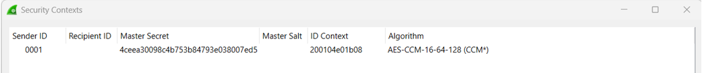

# Introduction

This folder contains code examples of how to use the stack.

The intention of the examples is to explain certain aspects of the stack.
e.g., provide information in how to build an KNX IoT Point API device based on the stack.

# Example Applications

The folder contains windows/linux GUI application demos, with several table views and 
interaction buttons. The code is defined in *.c and *.cpp files.

> Some demos uses *.c and *.cpp files. The *.c files hosts KNX data definitions and 
  application handlers, even it would be also possible to define all of this directly as 
  part of the *.cpp files. For the demo purpose the files remain separated __on purpose__,
  to have a nearly full application code skeleton (as c-file) for an embedded device 
  (only the **int main (void)** is missing). An complete example of skeleton can be found 
  in the c-file template 'knx_iot_application_template' in folder 'template'.

> Note that the file 'knx_iot_virtual.c/h' is NOT a part of the stack or not intended to be an 
  'application' library. It hosts only for the application demos commonly used functionality in 
  one place.

## Folder '/ems'
Energy Management System (EMS) [samples](apps/EMS/Readme.md) used to play with the stack and 
KNX based EMS applications (Inverter, Charger, Central Energy Manager).	

## Folder '/knx'
Common KNX samples of a **Light Switch Actuator Basic** (LSAB), **Light Switch Sensor Basic** (LSSB)
and a test application to pass the stack certification with the EITT test tool from KNX. 

### '/knx/eitt'

EITT stack test application.

- **knx_iot_virtual_eitt.cpp** 

The EITT test tool requests some predefined settings (serial number, datapoints, clean device,...), 
as defined in the EITT test template. Therefore this (EITT test) application does not support 
command line parameters. Hence this on application startup also a reset (erase code 2) is performed.

For the predefined settings from above see the corresponding *.c file. 
  
### '/knx/lsab' and 'knx/lssb'

KNX Light Switch Actuator Basic and Light Switch Sensor Basic demo applications, used to test the 
stack with the KNX ETS6 tool. 

- **knx_iot_virtual_lsab.c** and **knx_iot_virtual_lssb.c**
- **knx_iot_virtual_lsab.cpp** and **knx_iot_virtual_lssb.cpp**

> The above defined applications supports only their intended datapoints, e.g., for the sensor application only sensor datapoints.
If (for example) you enable for a sensor in ETS also the actuator functionality and assign to the actuator objects also GA's, 
the ETS download of sensor application to the virtual sensor device will fail (this demo behavior may be improved in the future). 

If there are multiple instances of the **same** virtual device run in the **same** network problems will occur (e. g.; 
two developers are testing at the same time their ETS projects with up and running lsab/lssb virtual devices on their computers).
This is due to the fact that at least two virtual devices uses then the same serial number. An ETS instance may then program not 
the intended device from the 'own' installation (it finds all in the network). 
If you run into this problem, you can change the serial number in one test instance (ETS project/ virtual devices). 

1. in the lsab/lssb c-file (for the virtual devices)
2. in the ETS project by updating the certificate (see [ETS6 pages](../../wikis/Home/ETS6))

### 'knx/ets'

Contains a (pre-registered) ETS6 **product** and a (predefined) ETS6 **project**.  

- **knx_iot_virtual_lsxb.knxprod** (product)
- **knx_iot_virtual_lsxb.knxproj** (project)

More details on how to use/edit the product and/or project in ETS6, for this see in [ETS6 pages](../../wikis/Home/ETS6).

# Wireshark

To test runtime communication with Wireshark (Windows) launch a demo application, trigger a telegram (e.g.; press 'SOO' button on LSSB demo),
some **OSCORE** frames shall appear on the ethernet/wifi NIC (usually with a IPv6 multicast address).

By adding the OSCORE 'Security Contexts' in Wireshark (see picture below), the actual payload becomes visible/decrypted. The values you 
can retrieve from the demo application File Dialog, 'List All Tables'. 

